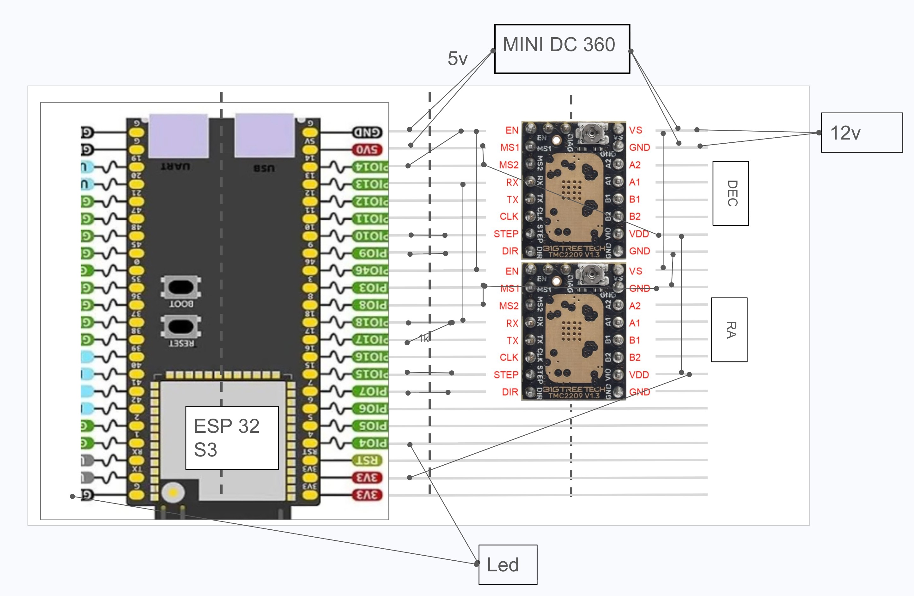
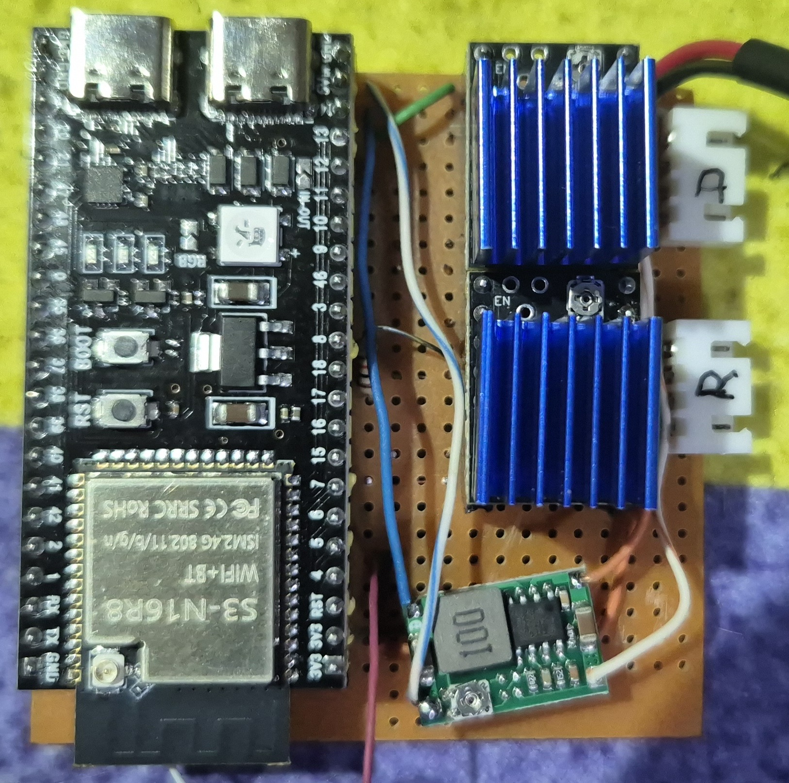

# monturita — No Precision Instruments Inc.

Fully functional mini equatorial mount toy powered by an ESP32-S3, controllable via N.I.N.A. (Alpaca / ASCOM)
and its own REST API.

This firmware runs on a Hosyond ESP32-S3 N16R8 board, driving two NEMA 17 stepper motors through
TMC2209 drivers. It exposes a full ASCOM Alpaca telescope interface on port 11111 so
N.I.N.A. and other clients can discover and control the mount directly.


## Architecture

```
N.I.N.A. / ASCOM client
Alpaca REST API  (port 11111)  ◄── also: UDP discovery on 32227
REST API  (port 80)  ── serves embedded SPA at /
  Mount  (orchestration, coordinates, settings)
  Motors  (move / track)
  TMC2209 UART driver  (hardware config & microstep control)

Network  (WiFi station + setup AP fallback)
USB Net  (RNDIS/ECM gadget, 192.168.7.1, DHCP server)
LED  (GPIO 4 PWM: dim / bright / breathing)
Runtime  (init sequence + periodic loop)
```

## Hardware

- **Board**: Hosyond ESP32-S3 N16R8 (ESP32-S3-WROOM-1, USB-C, 16 MB Flash, 8 MB PSRAM)
- **Motor drivers**: 2× TMC2209 (UART, StealthChop, 128 µsteps)
- **Motors**: 2× NEMA 17 (1.8° step, 1.4 A rated)
- **Reduction**: 20-tooth motor pulley → 80-tooth axis pulley (4:1)
- **Power**: Power supply input of 12v 5A and MINI DC 360 to convert 12v dc to 5v dc.
- **1k resistor**: for UART communication.
- **LED**: PWM indicator (GPIO 4) — three states: dim (~10%) at idle, bright (100%) during slewing, slow breathing on error (WiFi / UART). On-board LED unused.

### Pin mapping





| GPIO | Function           | Notes                        |
|------|--------------------|------------------------------|
| 4    | LED (PWM)          | External status indicator    |
| 7    | DEC DIR            | Declination axis direction   |
| 9    | RA DIR             | Right ascension axis dir     |
| 10   | RA STEP            | Right ascension step pulse   |
| 14   | MOTORS ENABLE      | Shared enable for both axes  |
| 15   | DEC STEP           | Declination step pulse       |
| 16   | STOP button        | Input, internal pull-up      |
| 17   | TMC2209 UART TX    | Via 1k series resistor       |
| 18   | TMC2209 UART RX    | Single-wire bus              |

## USB Ethernet (RNDIS/ECM)2

The ESP32-S3 acts as a USB Ethernet gadget via its native USB-OTG peripheral. Connect the mount to a laptop with a USB-C cable and it appears as a network adapter — no WiFi needed in the field.

| Property        | Value                    |
|-----------------|--------------------------|
| Protocol        | ECM (Linux/macOS) / RNDIS (Windows) |
| ESP32-S3 IP     | `192.168.7.1` (static)   |
| Host IP         | `192.168.7.2` – `192.168.7.10` (DHCP) |
| REST API        | `http://192.168.7.1/api/status` |
| Alpaca API      | `http://192.168.7.1:11111` |
| UDP Discovery   | `192.168.7.1:32227`      |

WiFi and USB Ethernet work simultaneously — all servers bind to `INADDR_ANY`.

### OS-specific notes

- **Windows 10/11**: RNDIS driver is built-in. The device appears as "Mount USB Ethernet" in Network adapters.
- **macOS**: CDC-ECM is natively supported. The interface appears as `usb0`.
- **Linux**: CDC-ECM is handled by the `cdc_ether` kernel module (loaded automatically).

## Setup

### Requirements

| Tool    | Version      | Purpose                       |
|---------|--------------|-------------------------------|
| ESP-IDF | v6.0.1       | Firmware build system         |
| Python  | 3.10+ (venv) | Required by ESP-IDF tools     |
| CMake   | 4.x          | Build system                  |
| Ninja   | 1.x          | Build executor                |
| Node.js | 22+          | Web UI build (`www/build.js`) |
| npm     | 9+           | UI dependencies (Alpine.js)   |

### macOS install

```sh
# ESP-IDF v6.0.1
mkdir -p ~/.espressif
git clone --depth 1 --branch v6.0.1 https://github.com/espressif/esp-idf.git ~/.espressif/v6.0.1/esp-idf
export IDF_TOOLS_PATH="$HOME/.espressif/tools"
cd ~/.espressif/v6.0.1/esp-idf && bash install.sh esp32s3

# build tools + Node.js
brew install cmake ninja node
cd www && npm install
```

Add to `~/.zshrc` (adjust paths to match your system):

```sh
export IDF_PATH="$HOME/.espressif/v6.0.1/esp-idf"
export IDF_TOOLS_PATH="$HOME/.espressif/tools"
export IDF_PYTHON_ENV_PATH="$HOME/.espressif/tools/python/v6.0.1/venv"
export PYTHON="$IDF_PYTHON_ENV_PATH/bin/python"
alias idf.py="$PYTHON $IDF_PATH/tools/idf.py"
```

### Build

```sh
idf.py set-target esp32s3
idf.py build flash monitor
```

### Web UI

The SPA lives in `www/src/` (HTML, CSS, JS). Rebuild the embedded UI with:

```sh
node www/build.js
idf.py build
```

The resulting `www/dist/index.html` is embedded into the firmware via `EMBED_TXTFILES`.

## Project conventions

- Language: **C** (C23), snake_case
- One `.c` file per use case within each module
- Public API: `module.h` — Internal API: `module_internal.h`
- Function prefix matches module name (`motors_`, `mount_`, `alpaca_bridge_`, …)
- Dependencies: REST → Mount → Motors → Motors Motion → TMC (no reverse deps)
